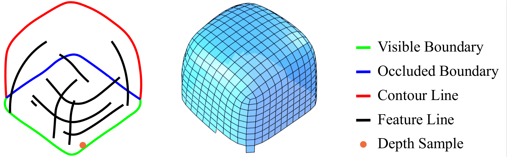
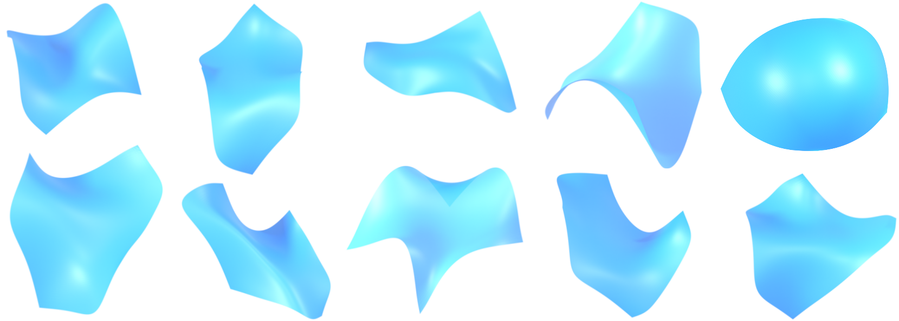
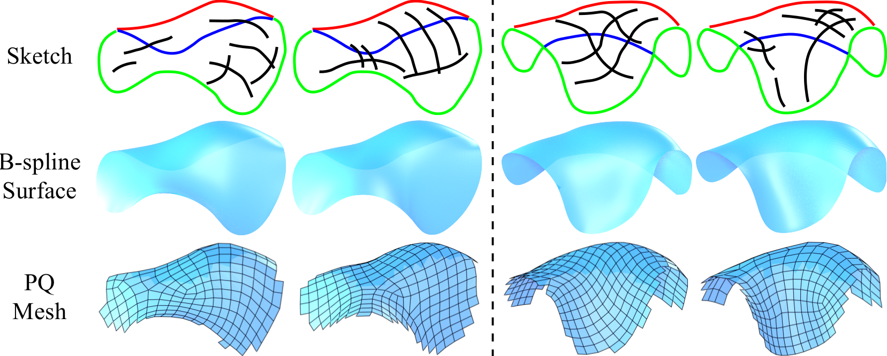

## Sketch2PQ [Video](https://rec.ustc.edu.cn/share/21b85b00-10a3-11ee-8ab0-1d920ced0508)
This repository is the implementation of our tvcg 2022 paper [Sketch2PQ: Freeform Planar Quadrilateral Mesh Design via a Single Sketch](https://arxiv.org/abs/2201.09367). 
Authors: Zhi Deng, [Yang Liu](https://xueyuhanlang.github.io/), [Hao Pan](https://haopan.github.io/), [Wassim Jabi](https://profiles.cardiff.ac.uk/staff/jabiw), [Juyong Zhang](http://staff.ustc.edu.cn/~juyong/), [Bailin Deng](http://www.bdeng.me/).

## UI
This ui system has been tested on Ubuntu 16.04, C++11, [Libtorch.1.1.0](https://pytorch.org/), [libigl](https://libigl.github.io/), [shappOp.0.1.0](https://www.shapeop.org/), gcc-5.5, [directional](https://github.com/avaxman/Directional), CUDA 10.1, opencv3.4, etc.

If you want to run our system, you will need to download the relevant libraries and pre-trained models. Once you have downloaded the files, simply extract them to the Sketch_PQ. You can follow the [installation.](https://github.com/Dengzhi-USTC/Sketch2PQ/blob/main/src/installation.md)

## [Datasets](https://rec.ustc.edu.cn/share/d0e0bef0-1336-11ee-b12a-d504bf32f245)

Based on geometric processing methods, we have synthesized a large number of three-dimensional free-form surfaces and also generated corresponding data pairs. These data are primarily used for training and testing various network modules. You can download the data from this [link](https://rec.ustc.edu.cn/share/d0e0bef0-1336-11ee-b12a-d504bf32f245)
).

## Results

## BibTex
If you find our work helpful, please consider citing.

@article{deng2022sketch2pq,
  title={Sketch2PQ: freeform planar quadrilateral mesh design via a single sketch},
  author={Deng, Zhi and Liu, Yang and Pan, Hao and Jabi, Wassim and Zhang, Juyong and Deng, Bailin},
  journal={IEEE Transactions on Visualization and Computer Graphics},
  year={2022},
  publisher={IEEE}
}

### Notes
If you have comments or questions, please contact Zhi Deng ([zhideng@mail.ustc.edu.cn]()).
